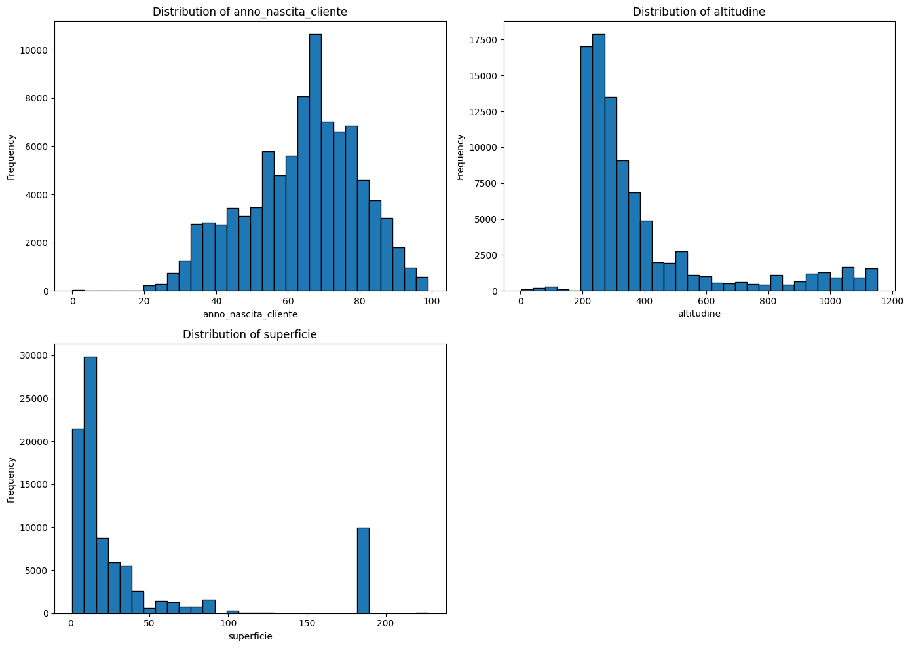

# Energy Consumption Analysis Project

## Project Overview
This project focuses on analyzing energy consumption data to understand temporal trends, seasonality, and the behavior of different client types. The analysis also aims to predict energy consumption using various machine learning models. This document will walk through the dataset, the objectives of the analysis, and the results obtained through the exploratory data analysis (EDA) and model building.

---

## 1. Dataset Description
The dataset contains energy consumption data measured in kWh along with various client attributes such as category, geographical information (latitude, longitude, altitude), and monthly details.

The variables include:
- **Energy Consumption (kWh)**
- **Client Category** (categorized as AZN, PRIV, PAMM, etc.)
- **Geographical Information** (latitude, longitude, altitude)
- **Time-based Information** (month, year)
- **Building Information** (surface area, altitude)
  
The objective is to identify trends in energy consumption, explore client differences, and predict future consumption patterns.

---

## 2. Objective
The main goals of the analysis are:
1. **Temporal Analysis**: Identify if the energy consumption shows any trends or seasonality.
2. **Client Type Analysis**: Investigate how different client types (e.g., private, public administration, industries) consume energy.
3. **Descriptive Analysis**: Understand key numerical and categorical variables related to consumption.
4. **Predictive Modeling**: Build machine learning models to predict energy consumption and identify the most important features influencing it.

---

## 3. Exploratory Data Analysis

### 3.1 Temporal Analysis

#### Energy Consumption by Year
The first analysis examines how energy consumption varies year over year.

- There is clear **seasonality** in the energy consumption data, with peaks in **December** and **July**. This likely corresponds to increased heating and air conditioning usage.
- Energy consumption in **2019** is slightly higher than in **2018** and **2017**, indicating a possible rising trend in usage.

#### Energy Consumption by Month
We then drill down further to look at the monthly trends.

- **July** has the highest average consumption, followed closely by **December** and **January**. This aligns with seasonal peaks due to climate-related energy demands.
  
These trends suggest that energy consumption is highly influenced by weather and the need for heating and cooling.

---

### 3.2 Client Type Analysis

The client types in the dataset are divided as follows:

| Categoria_cliente | Number of Observations |
|-------------------|------------------------|
| PRIV              | 90875                  |
| AZN               | 67462                  |
| PAMM              | 20063                  |
| COND              | 5553                   |
| NPRO              | 3070                   |
| GENP              | 149                    |

- **PRIV** represents private customers, the most common type in the dataset.
- **AZN** refers to businesses and has the second-highest number of observations.
- **PAMM** is the public administration, and its consumption can be significant due to its large-scale operations.

#### Energy Consumption by Client Type
The following plot shows energy consumption across different client types:

- As expected, **industries (AZN)** have much higher energy consumption compared to other categories. This is likely due to the larger size of industrial buildings and the energy demands of machinery.
- **Public administration (PAMM)** and **non-profit organizations (NPRO)** also have higher consumption levels, which is expected given the large size and responsibility of their operations.

---

### 3.3 Descriptive Analysis of Private Consumers

Since private consumers are quite different from companies, I performed a separate descriptive analysis for them.

#### Distribution of Numerical Variables

- The **age distribution** of private customers resembles the general demographic of Italy, with a relatively high average age. This could be due to younger people living with their parents.
- Most people live at **low altitudes**, but there are also those living in the mountains.
- **Surface area** tends to cluster around small-medium sized towns, but larger cities are also represented.

#### Distribution of Categorical Variables

- The distribution of **sex** shows a fairly even split between males and females.
- As noted with altitude, the majority of people live in **plains**, although some reside in **mountainous areas**.
- Most people live in **urbanized areas**, which aligns with energy consumption trends, as urban areas often consume more energy.

---

### 3.4 Energy Consumption vs Variables

#### Energy Consumption and Numerical Variables

- **Energy consumption** seems to be **homogeneously distributed** across age, altitude, and surface. However, there are peaks in consumption for **very large cities** and **high-altitude** areas, which could be due to the energy demands of large or remote buildings.

#### Energy Consumption and Categorical Variables

- **Mountain areas** show higher energy consumption, likely due to heating needs in colder climates.
- **Highly urbanized areas** also exhibit higher consumption, which may be linked to industrial and commercial activity.

---

## 4. Principal Component Analysis (PCA)

I performed a PCA to see if the data clusters in a specific way. The original variables include **surface (superficie)**, **longitude (long)**, **latitude (lati)**, **energy consumption (kWh)**, and **client categories** such as **AZN**.

### PCA Interpretation
- **PC1** has a strong positive loading on **surface** (0.249571) and a negative loading on **longitude (-0.182393)** and **latitude (-0.341526)**, capturing a combination of geographic and size-related variables. Larger surfaces increase along PC1, while longitude and latitude decrease.
- **PC2** is associated with a negative loading on **kWh (-0.226283)** and **AZN client category (-0.479002)**, indicating that PC2 may capture variations in energy consumption for certain client types.
- **PC3** shows a high positive loading on **kWh (0.195610)** and **AZN client category (0.480058)**, which suggests that it may explain variance in energy consumption, especially for AZN clients.
- **PC4** has a strong positive loading on **latitude (0.468518)**, indicating a geographical trend.

#### Monthly Variables
The monthly variables (e.g., **mese_3**, **mese_4**) capture seasonal trends, where some months (e.g., **July** and **August**) show higher energy consumption, aligning with the seasonal peaks observed in the exploratory analysis.

---

## 5. Predictive Modeling

I have fit several models to predict energy consumption (kWh) based on the available variables. After cleaning the data, transforming categorical variables into numerical ones, and checking for collinearity, I split the dataset into training and test sets. The evaluation metric used is **Mean Squared Error (MSE)**.

### Model Performance

Here are the MSE results for each model:

| Model              | MSE            |
|--------------------|----------------|
| Linear Regression  | 10883856.38     |
| Lasso              | 10883560.07     |
| Ridge              | 10883841.23     |
| Decision Tree      | 4057556.66      |
| Random Forest      | 2887767.71      |
| GAM                | 9021921.18      |
| Neural Network     | 9047016.93      |

- **Random Forest** outperforms all other models, with the lowest MSE of **2,887,767**. This suggests it captures the complexity and patterns in the data well.
- **Decision Tree** performs reasonably well but not as effectively as Random Forest, with an MSE of **4,057,556**.
- **Linear models** (Linear Regression, Lasso, Ridge) perform poorly, with high MSE values around **10,883,000**, indicating that a simple linear relationship is insufficient to explain the data.
- **GAM** and **Neural Network** models capture some non-linearity but underperform compared to the tree-based models.

### Feature Importance

I also examined the **feature importance** of the Random Forest model:

### Feature Importance Commentary

From the **feature importance** plot generated by the Random Forest model, the most critical feature is **available power in kWh for the supply point**. This result aligns with the overall objective of predicting energy consumption, as the available power logically correlates with the amount of energy a client can consume.

#### Linking to PCA Results
In the **PCA** analysis, we saw that **PC2** and **PC3** had strong loadings related to energy consumption, particularly for the **AZN (business) client category**. This reflects that businesses, which often have higher available power, contribute significantly to the variation in energy consumption across the dataset. The PCA confirmed that **kWh** and **client category (AZN)** are vital in explaining the variance in the dataset, which is consistent with the Random Forest's identification of **available power in kWh** as the most important feature.

The geographical variables, such as **longitude** and **latitude**, also played an important role in the **PCA** (notably in **PC1** and **PC4**), suggesting that energy consumption is influenced by location. The feature importance plot further emphasizes this by ranking **longitude** and **latitude** as highly influential factors, pointing to the geographical variability in energy needs (e.g., colder regions may require more heating).

#### Linking to Descriptive Analysis
In the **descriptive analysis**, we observed that regions with higher altitudes and more urbanized areas tend to have greater energy consumption, which is consistent with the feature importance rankings. **Altitude** ranks high in importance, likely because buildings in mountainous or colder regions require more energy for heating, as suggested by the consumption trends in mountain areas.

Additionally, **month** is another important feature, further supporting the strong **seasonality** observed in the **temporal analysis**. The peaks in energy consumption during **July** and **December** (due to air conditioning and heating, respectively) are captured both in the PCA (with monthly variables showing some variance) and in the feature importance analysis, where **month** contributes significantly.

Lastly, the feature importance of **type of payment** (which ranks lower but is still notable) may be linked to the financial structure of different client categories (e.g., businesses or public administrations) and their energy payment methods. This variable, though not heavily explored in the descriptive phase, could further explain consumption differences between clients.

---

## 6. Conclusion
- **Random Forest** outperformed other models, with the lowest MSE, confirming its ability to capture the complexity of the energy consumption data.
- The most critical feature, according to the **Random Forest model**, is **available power in kWh for the supply point**, highlighting its strong correlation with total energy consumption.
  
### Linking Feature Importance, PCA, and Descriptive Analysis:
- **Available power in kWh** aligns with findings from the **PCA**, where energy consumption (kWh) was a major driver in explaining the variance in the dataset, particularly for the **AZN (business) client category**.
- Geographical variables like **longitude**, **latitude**, and **altitude** were also important in both the **PCA** and feature importance rankings. 
  - **PCA** identified that **PC1** captured spatial features, and **PC4** showed geographic trends related to **latitude**.
  - **Descriptive analysis** indicated that **altitude** influences energy needs, with higher consumption in mountainous regions.
- **Month** was a significant feature, reinforcing the seasonality observed in the **temporal analysis**.
  - Peaks in **July** and **December** due to seasonal heating and cooling were reflected in both the **descriptive** and **PCA** results (monthly variables contributed variance).
- **Type of payment** appeared as a moderately important feature, potentially differentiating energy usage across client categories like **businesses** and **public administrations**.

### Final Takeaways:
- **Seasonality** (heating in winter, cooling in summer) and **geographic location** are major drivers of energy consumption, as seen from both PCA and feature importance analysis.
- **Industries and public administration** clients (AZN and PAMM) have significantly higher consumption levels, driven by their size and operational needs, which was confirmed by both the **descriptive analysis** and model feature rankings.
